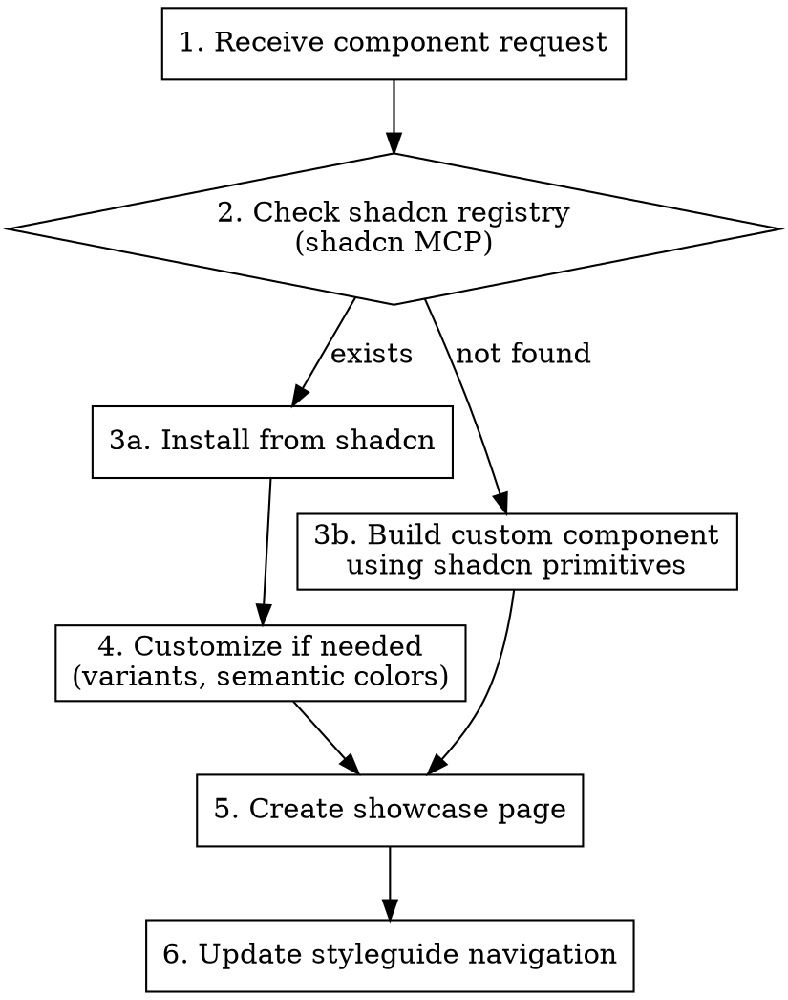

# Add Component to Design System

## Overview

Add a UI component to the project — either from the shadcn/ui registry or as a custom build. Creates the component, a showcase page with all variants/states, and updates the styleguide navigation.

## When to Use

- User says "add [component name] component"
- User wants to install a shadcn component with customization
- User needs a custom component that doesn't exist in shadcn
- User wants a component showcase page in the styleguide

**When NOT to use:**
- No design system exists yet (use `design-system:setup` first)
- User wants to build a full page from a design (use `design-system:build-page`)

## Workflow



### Step 1: Receive Component Request

User provides a component name (e.g., "Accordion", "HeatmapChart", "StatusCard").

### Step 2: Check shadcn Registry

Use shadcn MCP to search the registry:

- **Search:** `search_items_in_registries` with query "[component name]"
- **If found, view details:** `view_items_in_registries` to see structure and dependencies
- **Get usage examples:** `get_item_examples_from_registries` with query "[component]-demo"

**Decision:**
- Component exists in shadcn -> Step 3a (Install)
- Component doesn't exist -> Step 3b (Build Custom)

**Common shadcn components:**
- **Layout:** Card, Separator, Tabs, Accordion, Collapsible
- **Forms:** Button, Input, Select, Checkbox, Radio, Switch, Textarea, Label, Form
- **Feedback:** Alert, Toast, Progress, Skeleton, Badge
- **Overlay:** Dialog, Drawer, Popover, Tooltip, Dropdown Menu, Context Menu, Alert Dialog
- **Navigation:** Navigation Menu, Breadcrumb, Pagination, Command
- **Data:** Table, Data Table, Calendar, Chart

### Step 3a: Install shadcn Component

Get the install command using shadcn MCP:
- `get_add_command_for_items` for the component

```bash
npx shadcn@latest add [component-name]
```

This adds the component to `/components/ui/`. It automatically uses CSS variables from `globals.css`.

Review the installed component to understand:
- Available variants (size, style, etc.)
- Props interface
- How it uses CSS variables

### Step 3b: Build Custom Component

If shadcn doesn't have this component, build it using:
- shadcn primitives as building blocks
- CSS variables via Tailwind classes
- shadcn's patterns for consistency (cn utility, variant props)

```tsx
import { cn } from "@/lib/utils"

interface CustomWidgetProps {
  variant?: 'default' | 'primary' | 'muted'
  children: React.ReactNode
  className?: string
}

export function CustomWidget({
  variant = 'default',
  children,
  className
}: CustomWidgetProps) {
  return (
    <div className={cn(
      "rounded-lg border p-4",
      variant === 'default' && 'bg-card text-card-foreground border-border',
      variant === 'primary' && 'bg-primary text-primary-foreground border-primary',
      variant === 'muted' && 'bg-muted text-muted-foreground border-border',
      className
    )}>
      {children}
    </div>
  )
}
```

### Step 4: Customize Component (if needed)

If the base shadcn component needs additional variants or behavior, create a wrapped version in `/components/[ComponentName].tsx`:

```tsx
import { Button } from "@/components/ui/button"
import { cn } from "@/lib/utils"

interface CustomButtonProps extends React.ComponentProps<typeof Button> {
  intent?: 'default' | 'success' | 'warning' | 'info'
}

export function CustomButton({
  intent = 'default',
  className,
  ...props
}: CustomButtonProps) {
  return (
    <Button
      className={cn(
        intent === 'success' && 'bg-success text-success-foreground hover:bg-success/90',
        intent === 'warning' && 'bg-warning text-warning-foreground hover:bg-warning/90',
        intent === 'info' && 'bg-info text-info-foreground hover:bg-info/90',
        className
      )}
      {...props}
    />
  )
}
```

**Customization patterns:**
- Add new color variants using CSS variables (`bg-success`, `text-warning`, etc.)
- Add new size variants
- Compose multiple shadcn components together
- Add loading states, icons, or other features

### Step 5: Create Component Showcase

Add to `/app/styleguide/components/[component-name]/page.tsx`:

- All variants side by side (sizes, colors, styles)
- All states (default, hover, focus, disabled, loading)
- Dark mode preview (toggle between light/dark)
- Interactive demo with prop controls
- Code examples for common use cases
- Import statement and basic usage
- All available props with types and defaults
- Accessibility notes (keyboard navigation, ARIA attributes)

Use examples from shadcn MCP (`get_item_examples_from_registries`) as reference.

### Step 6: Update Styleguide Navigation

Add the new component to `/app/styleguide/navigation.ts`:

```ts
{
  title: "Components",
  items: [
    // ... existing components
    { name: "[Component Name]", href: "/styleguide/components/[component-name]" },
  ]
}
```

## Directory Structure

```
components/
  ui/                    # Base shadcn components (auto-generated)
    button.tsx
    card.tsx
    ...
  [CustomComponent].tsx  # Customized/new components

app/
  styleguide/
    components/
      [component-name]/
        page.tsx         # Component showcase
```

## Output Checklist

- [ ] Component installed/created in `/components/`
- [ ] Showcase page in `/app/styleguide/components/[name]/`
- [ ] Navigation updated in `/app/styleguide/navigation.ts`
- [ ] Component visible in styleguide sidebar
- [ ] Usage documented with code examples

## Common Mistakes

| Mistake | Fix |
|---|---|
| Rebuilding what shadcn already has | Always check registry first with shadcn MCP |
| Hardcoding colors instead of CSS vars | Use `bg-primary`, `text-success`, etc. |
| Not checking existing components | Look in `/components/` before creating |
| Missing accessibility | Add ARIA attributes, keyboard navigation |
| No dark mode testing | Test showcase in both light and dark modes |
| Skipping showcase page | Every component needs a showcase for documentation |
