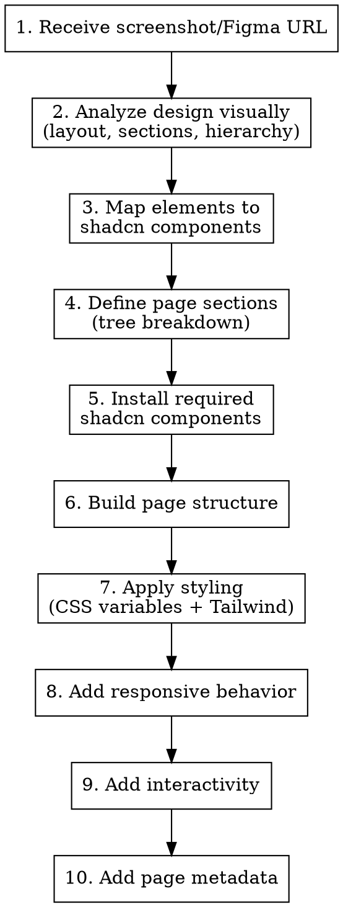

# Build Page from Design

## Overview

Analyze a visual design (screenshot, mockup, Figma URL) and build a complete page using existing design system components and tokens. Maps visual elements to shadcn components, installs any missing ones, and creates a responsive, interactive page.

## When to Use

- User shares a screenshot/mockup and says "build this page"
- User provides a Figma URL for page implementation
- User wants to convert a visual design into a working page
- Design system is already set up (globals.css tokens exist)

**When NOT to use:**
- No design system exists yet (use `design-system:setup` first)
- User wants to add a single component, not a full page (use `design-system:add-component`)

## Workflow



### Step 1: Receive Design Input

Accept one of:
- Screenshot/mockup image
- Figma URL (use Figma MCP: `get_design_context` with fileKey and nodeId)
- Rough wireframe or sketch

### Step 2: Analyze the Design Visually

Look at the image and identify:

**Layout Structure:**
- How many main sections/columns?
- Is there a sidebar? Header? Footer?
- What's the grid structure? (1-column, 2-column, 3-column)
- Container widths and spacing patterns

**UI Sections:**
- Break down the page into logical sections (top to bottom, left to right)
- Name each section by its purpose (e.g., "Sidebar Navigation", "Task List", "Chat Panel")

**Content Hierarchy:**
- What are the primary headings?
- What's the main content vs. supporting content?
- What are the call-to-action elements?

### Step 3: Map Visual Elements to shadcn Components

For each UI element, map to a component:

| Visual Element | shadcn Component | Notes |
|----------------|------------------|-------|
| Navigation sidebar | Sidebar | Use sidebar components |
| Tabs/segmented control | Tabs | For section switching |
| Cards with content | Card | CardHeader, CardContent, CardFooter |
| List of items | Card or Table | Depending on complexity |
| Buttons | Button | Note variant: default, outline, ghost |
| Form inputs | Input, Textarea | With Label |
| Dropdowns | Select or DropdownMenu | |
| Badges/tags | Badge | For status indicators |
| Icons | lucide-react icons | |
| Modal/dialog | Dialog | For overlays |
| Avatar/profile image | Avatar | |
| Progress indicator | Progress | |
| Checkbox/toggle | Checkbox or Switch | |

Use shadcn MCP to verify components exist:
- `search_items_in_registries` for each component type
- `get_add_command_for_items` to get install commands

**IMPORTANT:** Prioritize importing existing components from the design system over creating new ones. Check `/components/` first.

### Step 4: Define Page Sections

Create a section breakdown:

```
Page: [PAGE NAME]
+-- Header
|   +-- Logo/Brand
|   +-- Navigation tabs
|   +-- User actions
+-- Sidebar (if present)
|   +-- Navigation items
|   +-- ...
+-- Main Content
|   +-- Section 1: [name]
|   +-- Section 2: [name]
|   +-- ...
+-- Footer (if present)
```

### Step 5: Install Required Components

Install all needed shadcn components not yet in the project:

```bash
npx shadcn@latest add [component1] [component2] [component3] ...
```

### Step 6: Build Page Structure

Create `/app/[page-name]/page.tsx`:

```tsx
import { Card, CardHeader, CardContent } from "@/components/ui/card"
import { Button } from "@/components/ui/button"
import { Tabs, TabsList, TabsTrigger, TabsContent } from "@/components/ui/tabs"

export default function PageName() {
  return (
    <div className="flex min-h-screen">
      {/* Sidebar if present */}
      <aside className="w-64 border-r bg-sidebar">
        {/* Sidebar content */}
      </aside>

      {/* Main content */}
      <main className="flex-1">
        <header className="border-b p-4">
          {/* Header content */}
        </header>

        <div className="p-6">
          {/* Page sections */}
        </div>
      </main>
    </div>
  )
}
```

### Step 7: Apply Styling

Use Tailwind classes that reference CSS variables:
- Backgrounds: `bg-background`, `bg-card`, `bg-muted`, `bg-sidebar`
- Text: `text-foreground`, `text-muted-foreground`
- Borders: `border-border`
- Spacing: Tailwind's spacing scale (`p-4`, `gap-6`, `space-y-4`)
- Semantic: `bg-success`, `text-warning`, `border-info`

### Step 8: Responsive Behavior

Define how the layout adapts:
- **Mobile (< 768px):** Sidebar collapses, single column
- **Tablet (768px - 1024px):** Sidebar as overlay or mini
- **Desktop (> 1024px):** Full layout as designed

```tsx
<div className="flex flex-col md:flex-row">
  <aside className="hidden md:block md:w-64">
    {/* Sidebar - hidden on mobile */}
  </aside>
  <main className="flex-1">
    {/* Main content */}
  </main>
</div>
```

### Step 9: Add Interactivity

Implement:
- Navigation/routing between pages
- State for tabs, toggles, selections
- Form handling if applicable
- Loading and error states

### Step 10: Add Page Metadata

```tsx
export const metadata = {
  title: 'Page Title',
  description: 'Page description for SEO',
}
```

## Output Checklist

- [ ] List of identified sections and component mapping
- [ ] All required shadcn components installed
- [ ] Page created at `/app/[page-name]/page.tsx`
- [ ] Responsive layout matching the design
- [ ] Interactive elements working
- [ ] Page metadata defined

## Common Mistakes

| Mistake | Fix |
|---|---|
| Building components that already exist | Check `/components/` and `/components/ui/` first |
| Hardcoding colors instead of using tokens | Always use `bg-primary`, `text-muted-foreground` etc. |
| Ignoring responsive behavior | Define mobile/tablet/desktop breakpoints from the start |
| Not analyzing the full design first | Complete visual analysis before writing any code |
| Creating new components instead of composing existing ones | Compose existing shadcn components first |
| Missing accessibility | Add ARIA attributes, keyboard navigation, semantic HTML |
