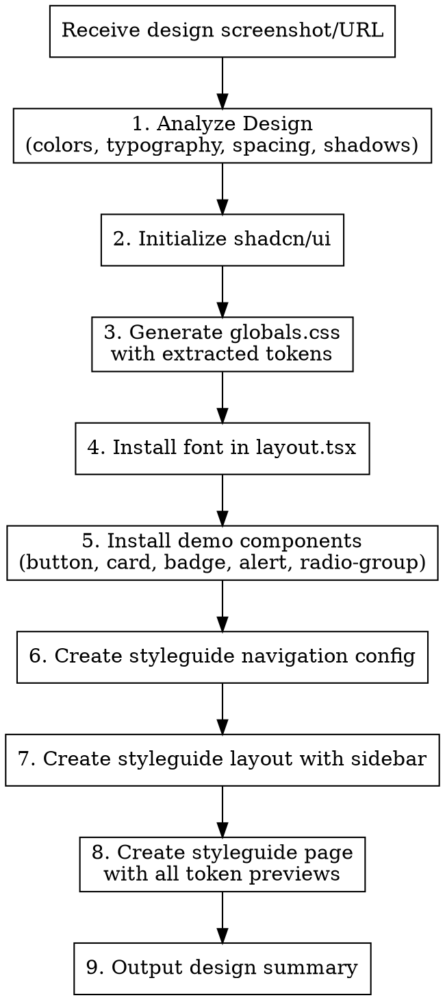

# Design System Setup from Screenshot

## Overview

Extract design tokens from a visual reference (screenshot, Dribbble, Behance, Figma) and scaffold a complete design system with shadcn/ui — including globals.css tokens, font setup, demo components, and a navigable styleguide.

## When to Use

- User shares a design screenshot or inspiration image
- User provides a Dribbble/Behance/Figma URL for design extraction
- User wants to bootstrap a new design system from visual reference
- User says "set up design system", "extract tokens", "create styleguide from this design"

**When NOT to use:**
- User already has a design system and wants to add components (use `design-system:add-component`)
- User wants to build a page from a design (use `design-system:build-page`)
- User wants to modify existing tokens without visual reference

## Workflow



### Step 1: Analyze the Design

Look at the image and extract/infer:

**Colors:**
- Primary/brand color -> generate full scale (50-900)
- Neutral/grey -> generate full scale (50-900)
- Semantic: success (green), error (red), warning (amber), info (blue)
- Background, surface, border colors

**Typography:**
- Font family (identify or infer closest Google Font)
- Heading sizes and weights
- Body text sizes

**Spacing & Radius:**
- Spacing rhythm: tight (4px base), normal (8px), relaxed (12px)
- Border radius: sharp (2-4px), rounded (6-8px), pill (9999px)

**Shadows:**
- Style: none, subtle (sm), prominent (lg)

**When colors aren't clearly visible:** Make reasonable inferences. Generate harmonious scales using color theory. Ensure 4.5:1 contrast for text accessibility. Use shadcn defaults as fallback.

### Step 2: Initialize shadcn

```bash
npx shadcn@latest init
```

Options: Style=Default, Base color=Neutral, CSS variables=Yes.

**Skip if already initialized** (check for `components.json` or existing `components/ui/`).

### Step 3: Generate globals.css

Replace `/app/globals.css` with extracted design tokens. See `globals-template.css` in this skill directory for the complete template structure.

Key sections:
- `:root` with all light theme variables
- `.dark` with inverted dark mode values
- `@theme inline` block mapping CSS vars to Tailwind v4
- Custom semantic colors (success, warning, info)
- Body base styles

**Use oklch color space** when possible for perceptually uniform color scales.

### Step 4: Install Font

Add the identified Google Font to `/app/layout.tsx` using `next/font/google`:

```tsx
import { Inter } from 'next/font/google' // or matched font
const font = Inter({ subsets: ['latin'] })
// Apply via className on <body>
```

### Step 5: Install Demo Components

```bash
npx shadcn@latest add button card badge alert radio-group
```

These provide immediate visual validation of the design tokens.

### Step 6: Create Navigation Config

Create `/app/styleguide/navigation.ts` — see `styleguide-templates.md` for full template.

This config is extensible: future component additions just add entries to the `items` array.

### Step 7: Create Styleguide Layout

Create `/app/styleguide/layout.tsx` with fixed sidebar reading from navigation config. See `styleguide-templates.md`.

### Step 8: Create Styleguide Page

Create `/app/styleguide/page.tsx` displaying ALL design tokens:

- Color palette swatches with CSS variable names
- Primary scale (50-900) and Grey scale (50-900)
- Semantic colors (success, warning, error, info)
- Typography samples (headings, body)
- Border radius examples
- Shadow examples
- Live component demos (Button, Card, Badge, Alert, RadioGroup)
- Dark mode toggle

### Step 9: Output Design Summary

After setup, provide:

```
- Primary color: [hex] ([color name])
- Font: [font name]
- Style: [e.g., "Modern minimal", "Bold colorful"]
- Border radius: [e.g., "Rounded 8px", "Sharp 2px"]
- Overall feel: [brief description]
```

## Directory Structure Created

```
app/
  globals.css              # Design tokens
  layout.tsx               # Font setup
  styleguide/
    layout.tsx             # Sidebar navigation layout
    navigation.ts          # Nav config (extendable)
    page.tsx               # All tokens + component demos
    components/            # Future: individual component pages
      [name]/page.tsx
```

## Quick Reference

| Token Category | CSS Variable Pattern | Example |
|---|---|---|
| Base | `--background`, `--foreground` | Page bg, text |
| Components | `--card`, `--popover` | Surface colors |
| Brand | `--primary`, `--secondary` | Main actions |
| State | `--muted`, `--accent` | Subtle UI |
| Semantic | `--success`, `--warning`, `--info` | Feedback |
| Form | `--border`, `--input`, `--ring` | Inputs, focus |
| Layout | `--sidebar-*` | Sidebar theming |
| Charts | `--chart-1` through `--chart-5` | Data viz |
| Radius | `--radius` | Border radius base |

## Common Mistakes

| Mistake | Fix |
|---|---|
| Using hex in Tailwind v4 instead of CSS vars | Always use `@theme inline` block to bridge vars |
| Forgetting dark mode inverses | Generate `.dark` block for every `:root` variable |
| Low contrast semantic colors | Test against WCAG 4.5:1 for text, 3:1 for large text |
| Hardcoded font in CSS | Use `next/font/google` for optimal loading |
| Not generating full color scales | Always provide 50-900 for primary and neutral |
| Chart colors too similar | Pick from different hue segments for distinction |
